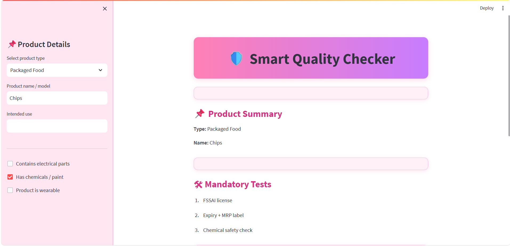
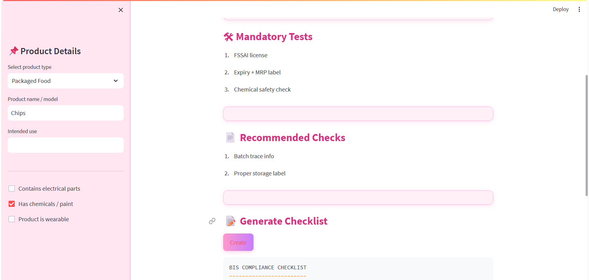
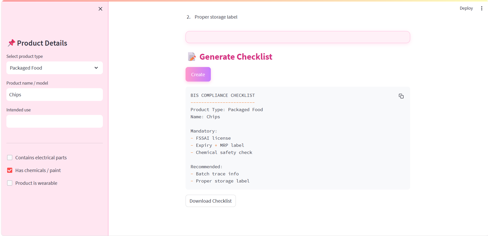

# 🛡️ Smart Quality Checker

A simple product validation tool that generates **mandatory and recommended quality checklists** for different product types. Built using **Streamlit**, with a modern, visually appealing pink-purple interface. Perfect for learning, internships, and resume projects.

---

## 🚀 Features
- User-friendly interface with **pink-purple theme**.
- Select product type: Electronics, Helmet, Packaged Food, Toy, or Other.
- Input product details like **name, intended use**, and additional properties.
- Automatically generates:
  - **Mandatory tests**
  - **Recommended checks**
- Handles special cases for **electrical, chemical, and wearable products**.
- **Downloadable checklist** as `.txt` file.
- Responsive layout with clean and readable code.

---

## 📝 How It Works
- Rules for each product type are defined in a **Python dictionary**.
- User inputs are collected via **Streamlit sidebar**.
- Mandatory and recommended tests are dynamically updated based on inputs.
- Checklist can be viewed on the app or downloaded.

---

## 🛠️ Tech Stack
- **Python**  
- **Streamlit**  
- **HTML & CSS**

---

## ⚡ Getting Started
1. **Clone the repository**:  
   ```bash
   git clone <your-repo-url>

## 📸 Screenshots

### 1. First Screenshot


### 2. Second Screenshot


### 3. Third Screenshot

